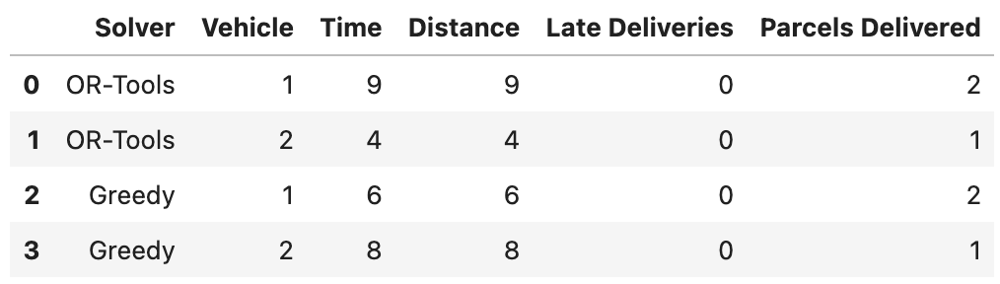

# RouteSandbox

**RouteSandbox** is a backend-driven route optimization simulator designed to explore real-world logistics challenges through code.This project simulates parcel deliveries across a virtual city and applies constraint-based algorithms to optimize delivery routes.

This project is a personal learning initiative.

---

## Project Goals

- Build a realistic simulation of parcel delivery routing under constraints (time windows, vehicle capacity).
- Implement and compare routing algorithms (greedy, optimization via OR-Tools).
- Deploy and orchestrate microservices in a local Minikube Kubernetes cluster.

---

## Tech Stack

| Area                    | Technology Used                                    |
|-------------------------|----------------------------------------------------|
| **Backend API**         | Java (Spring Boot)                                 |
| **Optimization Engine** | Python (FastAPI) with Google OR-Tools              |
| **Containerization**    | Docker                                             |
| **Local Orchestration** | Kubernetes (via Minikube)                          |
| **API Communication**   | REST (HTTP/JSON)                                   |
| **CI/CD**               | GitHub Actions (build, lint, test)                 |
| **Simulation Data**     | JSON files (in-memory, no external DB)             |
| **Ingress & Routing**   | Minikube Ingress addon *or* `kubectl port-forward` |

---

## Instructions

To build the optimizer app Docker image run:

```shell
docker build -t routesandbox-optimizer optimizer/
```

To run the image:

```shell
docker run -p 8000:8000 routesandbox-optimizer
```

To check locally if the image works:

```shell
curl -X POST http://localhost:8000/optimize \
  -H "Content-Type: application/json" \
  --data-binary @data/sample_problems/example.json
```

After you have the optimizer up and running, you can use the instructions from [README.md](optimizer/README.md) to do a
visual comparison between OR-Tools and the Greedy algorithm.

---

### Debugging the route

`visualize.py` is a small tool designed to help during development to visually inspect and compare delivery routes produced
by the optimizer service.

It generates a simple directed graph of each vehicle's route using `networkx` and `matplotlib`.

#### How to run the debug tool?

Under `/optimizer` there is a `sample_output.json` file. Update it with the result you've got from the `backend` service.
To start the visualizing tool:

```shell
python optimizer/visualize.py
```

Before running the script, make sure you've installed the required libraries:

```shell
pip install matplotlib networkx
```

---

### Optimizer visualization

The file `optimizer/analyze_routes.ipynb` provides a visual comparison between the OR-Tools and Greedy solvers.

This notebook lets you:

* Load and compare optimizer output from both solvers
* Analyze total delivery time, distance, and constraint violations
* Visualize metrics with bar charts using pandas, matplotlib, and seaborn


#### How to use it

1. Install required Python packages

    ```shell
    pip install notebook pandas matplotlib seaborn
    ```

2. Start Jupyter:

    ```shell
    jupyter notebook
    ```

3. Open the notebook `optimizer/analyze_routes.ipynb`.
   Make sure you have result files in optimizer/:
* sample_output.json — output from the OR-Tools solver
* sample_output_greedy.json — output from the Greedy solver

You can generate these by calling the API with `?solver=ortools` or `?solver=greedy`.

Run all cells to view tables and comparison charts.

#### Sample Output




---

## Docs & Architecture

> Coming soon:
> - ADRs (Architectural Decision Records)
> - Architecture diagrams (services, data flow)

---

## Contributions

This project is personal, but contributions, suggestions and feedback are welcome!
