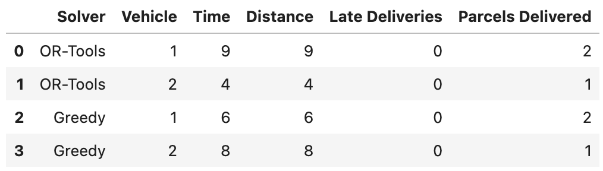
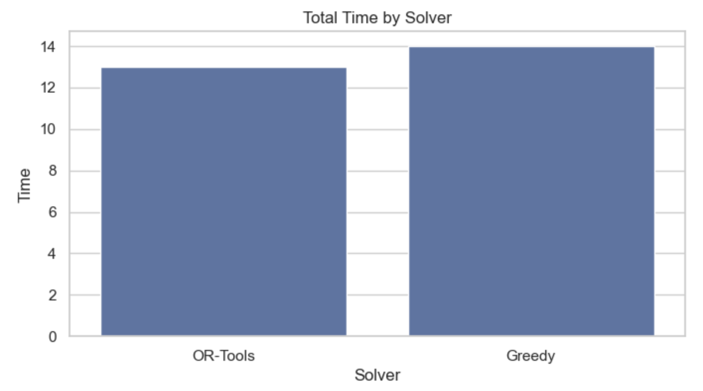
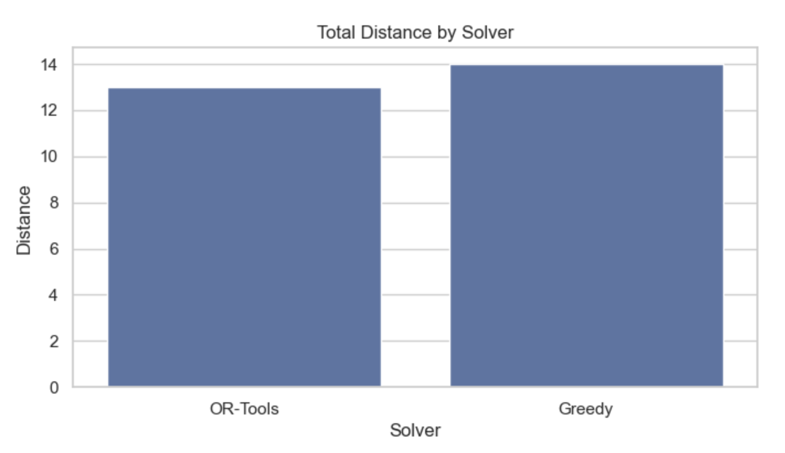
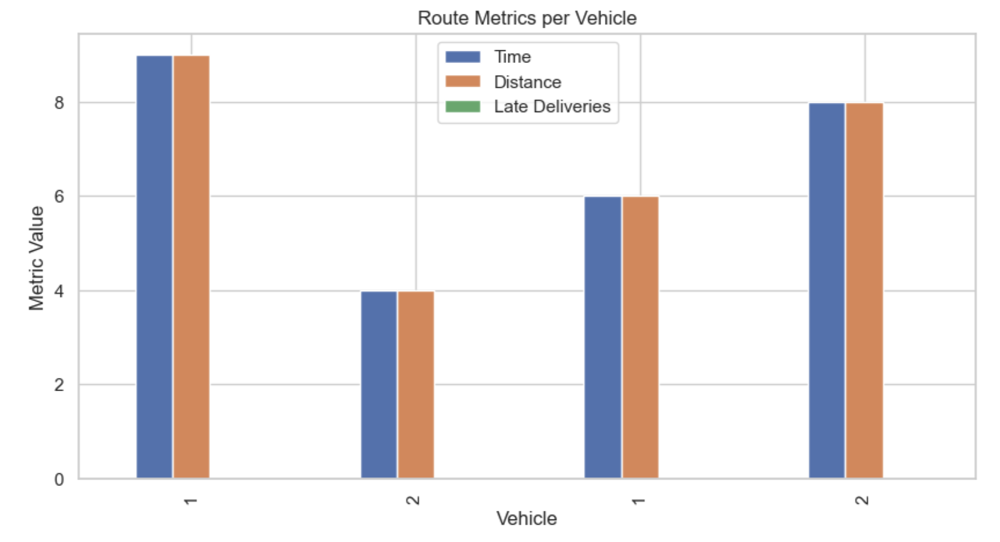

# Optimizer visualization

The file analyze_routes.ipynb provides a visual comparison between the OR-Tools and Greedy solvers.

This notebook lets you:

* Load and compare optimizer output from both solvers
* Analyze total delivery time, distance, and constraint violations
* Visualize metrics with bar charts using pandas, matplotlib, and seaborn


## How to use it

1. Install required Python packages

    ```shell
    pip install notebook pandas matplotlib seaborn
    ```

2. Start Jupyter:

    ```shell
    jupyter notebook
    ```

3. Open the notebook `optimizer/analyze_routes.ipynb`.
Make sure you have result files in optimizer/:
* sample_output.json — output from the OR-Tools solver
* sample_output_greedy.json — output from the Greedy solver

You can generate these by calling the API with `?solver=ortools` or `?solver=greedy`.

Run all cells to view tables and comparison charts.

#### Sample Output







